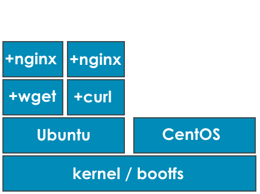
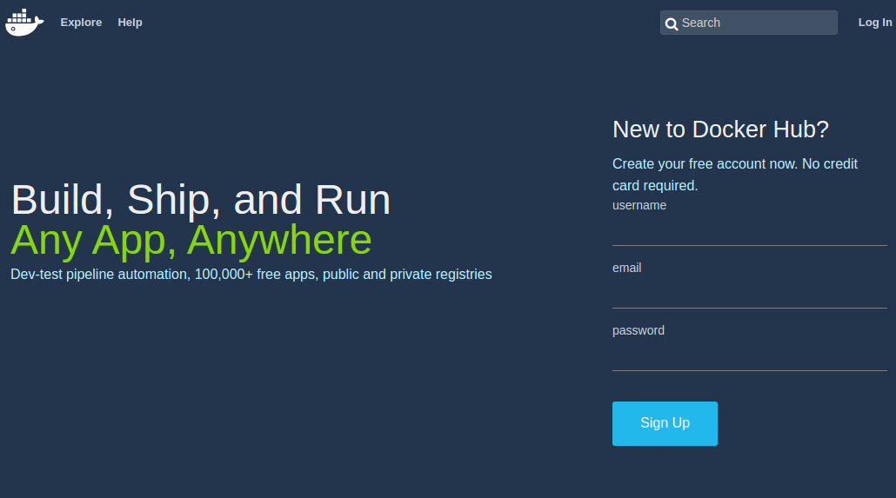
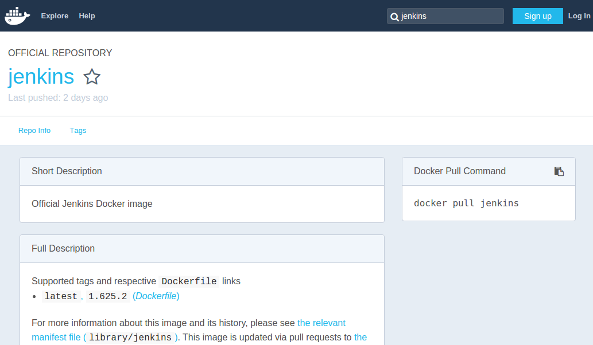

# Anatomie

<figure style="position: absolute; bottom: 300px; right: 300px;">
    
</figure>


## Conteneur

- Environnement d'exécution isolé
- Très faible empreinte mémoire
- Concept éprouvé depuis de nombreuses années
  - "Zone" sous Solaris
  - "Jail" sous BSD
  - "Workload Partitions" sous AIX
  - Utilisation du Noyau linux

Notes :
Environnement d'exécution isolé = ~chroot linux
Noyau linux : primitives implémentées depuis 2008


## VMs vs Conteneurs

<br/>


## Architecture

- Développé en Go
- OSS / https://github.com/docker
- Architecture client / server
- API REST commune aux différentes briques

<figure style="position: absolute; bottom: 50px; right: 50px;">
    
</figure>


## Standing on the shoulders of giant


Notes :
libcontainer : Libcontainer enables containers to work with Linux namespaces, control groups, capabilities, AppArmor, security profiles, network interfaces and firewalling rules in a consistent and predictable way. (http://jancorg.github.io/blog/2015/01/03/libcontainer-overview/)
libvirt : A toolkit to interact with the virtualization capabilities of recent versions of Linux (and other OSes) (https://libvirt.org/)
LXC (Linux Containers) is an operating-system-level virtualization method for running multiple isolated Linux systems (containers) on a control host using a single Linux kernel.
systemd-nspawn may be used to run a command or OS in a light-weight namespace container. (https://www.freedesktop.org/software/systemd/man/systemd-nspawn.html)
cgroups : Control Groups, or cgroups for short, allow you to set limits on resources for processes and their children. This is the mechanism that Docker uses to control limits on
memory, swap, and CPU resources.
Namespaces take a single global resource and make it appear as a single owned resource to the container.
Netlink socket family is a Linux kernel interface used for inter-process communication (IPC) between both the kernel and userspace processes, and between different userspace processes, in a way similar to the Unix domain sockets. Netlink is designed and used for transferring miscellaneous networking information between the kernel space and userspace processes.
Security-Enhanced Linux (SELinux) is a Linux kernel security module that provides a mechanism for supporting access control security policies. a set of kernel modifications and user-space tools that have been added to various Linux distributions.
netfilter.org is home to the software of the packet filtering framework inside the Linux 2.4.x and later kernel series. Software inside this framework enables packet filtering, network address [and port] translation (NA[P]T) and other packet mangling.
Capabilities (POSIX 1003.1e, capabilities(7)) provide fine-grained control over superuser permissions, allowing use of the root user to be avoided.
AppArmor ("Application Armor") is a Linux kernel security module that allows the system administrator to restrict programs' capabilities with per-program profiles.

## Concepts

- **Image**: Ensemble des données / méta données nécessaires au fonctionnement (~ template / read-only)
- **Registry**: Dépôt d'image (public / private)
- **Conteneur**: Instance d'une image
- **Volumes**: Accès au FS de l'hôte
- **Links / Networks**: Partage de la stack réseau entre conteneurs

<!-- .element: class="align-right" -->
/Repeat after me/ *Containers ARE NOT VMs !*


## Basics

<br/>
L'image contient le nécessaire pour faire fonctionner le conteneur.

<br/>
Le cycle de vie d'un conteneur est directement lié à l'exécution de la commande principale.

<br/>
Droit root par défaut dans un conteneur.

<br/>
Philosophie : Un seul et unique service (apache, tomcat, nginx, redis...) s'exécute dans un conteneur.


Notes :
Complétement isolé et n'a pas accès par défaut à la machine hôte ni aux autres conteneurs (comme les VMs)
Pas de ssh, pas de Chef ou Vagrant


## Images

- Téléchargées depuis un dépôt
- Importées depuis une archive "tarball" (ubuntu, centos, ...)
- Construites depuis un `docker commit`
- Construites depuis un *Dockerfile*
- ...elles sont toujours en lecture seule




## Dockerfile

```
FROM komljen/jdk-oracle
MAINTAINER Alen Komljen <alen.komljen@live.com>

RUN \
  wget -q -O - http://pkg.jenkins-ci.org/debian/jenkins-ci.org.key \
       | apt-key add -
RUN echo "deb http://pkg.jenkins-ci.org/debian binary/" \
       > /etc/apt/sources.list.d/jenkins.list
RUN apt-get update
RUN apt-get -y install jenkins && rm -rf /var/lib/apt/lists/

VOLUME ["/root/.jenkins"]

RUN rm /usr/sbin/policy-rc.d
CMD ["/usr/bin/java", "-jar", "/usr/share/jenkins/jenkins.war", "--webroot=/root/.jenkins/web"]

EXPOSE 8080
```

Notes :
The VOLUME instruction creates a mount point with the specified name and marks it as holding externally mounted volumes from native host or other containers.


## Mon premier conteneur

<br/>
```
$ docker run docker/whalesay cowsay "big up @Technicolor"
 _____________________
< big up @Technicolor >
 ---------------------
    \
     \
      \     
                    ##        .            
              ## ## ##       ==            
           ## ## ## ##      ===            
       /""""""""""""""""___/ ===        
  ~~~ {~~ ~~~~ ~~~ ~~~~ ~~ ~ /  ===- ~~~   
       \______ o          __/            
        \    \        __/             
          \____\______/   

```


## En pratique

- Docker récupère ("pull") les couches de filesystem read-only
- Il ajoute une couche en lecture écriture
- Il met en place le "copy on write"
- Il bind les ports
- Il monte les volumes
- Il génère un nom pour le conteneur (et un sha256)
- Il lance la commande dans le conteneur

<figure style="position: absolute; bottom: 100px; right: 150px;">
    
</figure>

Notes :
Copy-on-write is a similar strategy of sharing and copying. In this strategy, system processes that need the same data share the same instance of that data rather than having their own copy. At some point, if one process needs to modify or write to the data, only then does the operating system make a copy of the data for that process to use. Only the process that needs to write has access to the data copy. All the other processes continue to use the original data.


## En pratique - la CLI

Options:

 - ``-it``: mode intéractif
 - ``-d``: mode détaché ou "daemon"
 - ``--name``: pour nommer le conteneur
 - ``--rm``: pour supprimer le conteneur après exécution
 - ``-p``: publication de port `<host>:<container>`
 - ``--volume``: gestion des volumes
 - ``--link``: gestion des links
 - ``--net``: gestion du réseau

Notes :
--link : permet de linker un conteneur à un autre (utiliser le nom d'hote
du conteneur linké dans l'autre conteneur)


## Quick start

- Récupérer une image:

```
docker pull ubuntu:15.04
```

- Lancer une instance:

```
docker run --rm -it ubuntu:15.04 bash
```

- Lister les instances:

```
docker ps
```

- Démarrer / Arrêter une instance:

```
docker stop  <container-name-or-id>
docker start <container-name-or-id>
```


# Le Docker Hub




## Moteur de recherche


## Exemple d'entrée




# Résumé


# Demo time


