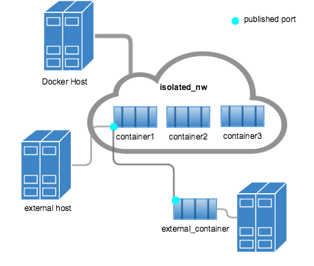

# Volumes & Networks

Notes :
- Un conteneur est volatile
- Une fois détruit, les données écrites dedans sont perdues

## Volumes

Expose un sous ensemble du file system de l'hôte dans un conteneur

⟺

<!-- .element class="align-right" -->
Expose le file system d'un conteneur dans l'hôte

 
⚠ Celui qui écrit le fichier est responsable des droits

 
Utilisation:

- péréniser les données d'une base de données
- pousser une application dans un conteneur
- récupérer les logs d'une application s'exécutant dans un conteneur

## Networks

 
Permet de créer un réseau multi-hôtes.

 
Offre une isolation pour les containers

 
Par défault, Bridge sur l'hôte, mais mécanisme de plugins

 
<!-- .element class="align-right" -->
> Les piles sont fournies mais changeables

## Besoin

