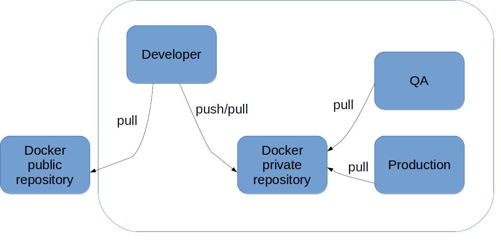

# écosystème Docker

<figure style="position: absolute; bottom: 10px; right: 200px">
    
</figure>

Notes :
L'ensemble des outils ci après sont OSS et gratuits


# docker compose

<figure style="position: absolute; bottom: 50px; right: 400px">
    
</figure>


## Use case

Permet de démarrer plusieurs conteneurs simultanément

<br/>
Idéal pour le développement

<br/>
Fichier de configuration yaml simple

<br/>
Image, liens, volumes, # instances

<br/>
Contrôle un ensemble cohérent de conteneurs


## docker-compose.yml

```
web:
  build: .
  ports:
   - "5000:5000"
  volumes:
   - .:/code
  links:
   - redis
redis:
  image: redis
```


# Demo time


# docker registry

<figure style="position: absolute; bottom: 200px; right: 200px">
    
</figure>


# docker machine

<figure style="position: absolute; bottom: 50px; right: 400px">
    
</figure>


# docker machine, cas d'utilisation

<br/><br/><br/><br/><br/><br/>
Pour utiliser Docker facilement sous Mac et Windows

Pour installer Docker sur des machines distantes (des "machines")


# docker machine

<br/><br/><br/><br/><br/>
Installation et configuration simple pour Linux, Windows, MacOS, Google, AWS, ...

<figure style="position: absolute; bottom: 50px; right: 150px">
    
</figure>

<figure style="position: absolute; bottom: 50px; right: 600px">
    
</figure>


# docker kitematic

<br/><br/><br/><br/><br/>
GUI de gestion pour Mac et Windows

<figure style="position: absolute; bottom: 150px; right: 250px">
    
</figure>
<figure style="position: absolute; bottom: 150px; left: 250px">
    
</figure>


## kitematic, gui for docker #1


## kitematic, gui for docker #2


## kitematic, gui for docker #3


# docker toolbox

<br/><br/><br/><br/><br/>
Pour Mac et Windows. Inclut Docker, Compose, Machine, Kitematic.

<figure style="position: absolute; bottom: 150px; right: 350px">
    
</figure>
