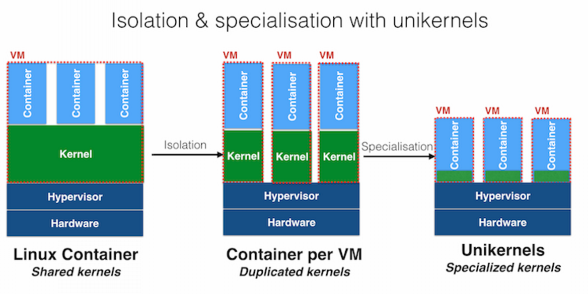
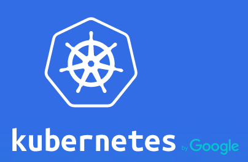
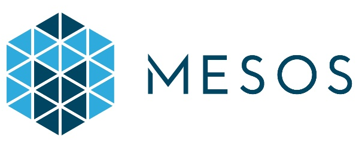
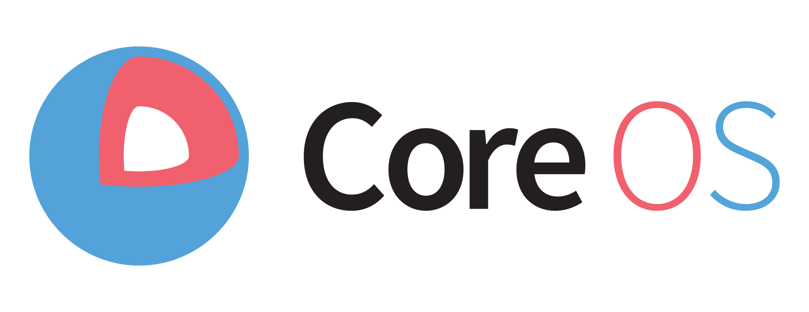
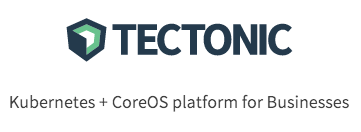

# What's new?

<figure style="position: absolute; bottom: 100px; right: 350px">
    
</figure>

## Releases

 
- Docker engine 1.11

 
- Docker swarm 1.2

 
- Docker compose 1.7

 
- Docker registry 2.4

Notes :
1.9.1 (2015-11-21)

## Docker 1.9 21/11/15

- `docker build -e HTTP_PROXY=http://my-proxy:3128 -t my-image .` (ou encore `--build-arg`)
- `docker stats` - métriques I/O
- `docker volume` - Gestion du stockage
- `docker network` - Multi-host Networking
- architecture en plugins (FS, Réseaux, Registry, stockage, ...)

## Docker 1.10 - 04/02/16

- Sécurité : notamment le *user namespace*
- Changement du format de stockage image "content-addressable"
- `docker events`
- `docker update` - Mise à jour à chaud de contraintes sur un conteneur
- Contraintes sur les I/O disques

Notes :
Content addressable image IDs = Image IDs now represent the content that is inside an image, in a similar way to how Git commit hashes represent the content inside commits.
docker events : event stream

## Docker 1.11 - 12/04/16

- Compliance au format standard de conteneurs (`runC`)
- Redémarrage de l'Engine sans redémarrer les conteneurs
- Labels réseaux et volumes
- Meilleure gestion en cas d'espace disque faible

Notes :
https://blog.docker.com/2016/04/docker-engine-1-11-runc/

## Tutum

- Entre PAAS et IAAS : Container As A Service, racheté par Docker Inc.

<figure style="position: absolute; bottom: 20px;">
	
</figure>

Notes :
Acheté le 21 Octobre 2015

## Unikernel

- 21/01 : [TechCrunch] Docker Acquires Unikernel Systems As It Looks Beyond Containers
<figure style="position: absolute; bottom: 125px;">
	
</figure>

## Golang 1.6

- 17/02 : Go 1.6 is released
<figure style="position: absolute; bottom: 125px;">
  
</figure>

## Conductant & Apache Aurora

- 03/03 [VentureBeat] Docker buys startup Conductant, will integrate Apache Aurora into its software
 
 
Aurora est un framework d'orchestration pour le gestionnaire de cluster Apache Mesos, permettant de faire tourner des applications de manière distribuée et hautement disponible.

<figure style="position: absolute; bottom: 250px;">
  
</figure>

Notes :
scheduler that can deploy workloads in association with the Apache Mesos software

## Un écosystème complet

- De l'orchestration à l'OS

<figure style="position: absolute; bottom: 375px;">
	
</figure>
<figure style="position: absolute; bottom: 225px;">
	
</figure>
<figure style="position: absolute; bottom: 20px;">
	
</figure>
<figure style="position: absolute; bottom: 400px; left:300px">
	
</figure>
<figure style="position: absolute; bottom: 225px; left:500px">
	
</figure>
<figure style="position: absolute; bottom: 50px; left:650px">
	
</figure>
