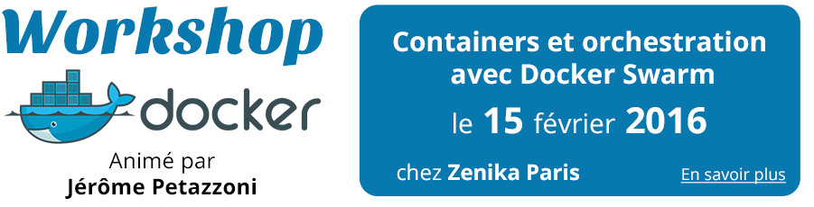
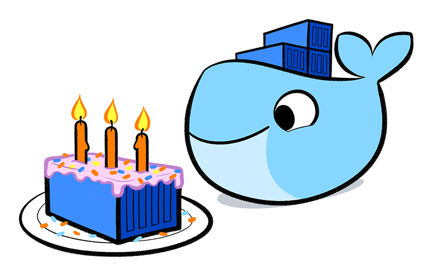

# Zenika explique Docker

<figure style="position: absolute; bottom: 200px; right: 200px">
	<iframe width="560" height="315" src="https://www.youtube.com/embed/Wj2xBIQNwkE" frameborder="0" allowfullscreen></iframe>
</figure>

## Usecases client DEV @Zenika

Avantages d'utiliser Docker sur le poste de Dev :

* Pas besoin d'installer manuellement le projet sur la machine de dev
* Pas besoin de le configurer et montée de version simplifiée

<figure style="position: absolute; bottom: 350px;">
	
</figure>
<!--<figure style="position: absolute; bottom: 340px; left:410px">
	
</figure>
-->
<figure style="position: absolute; bottom: 345px; left:730px">
	
</figure>

     

=> Changement rapide de contexte & de projet
 
=> Un Dev qui arrive sur le projet peut lancer le projet uniquement en connaissant Docker.

## Usecases client OPS @Zenika

Avantages d'utiliser Docker en production :

* Même langage que le Dev
* Conteneur = Unité logique Ops

<figure style="position: absolute; bottom: 300px;">
	
</figure>
<!--
<figure style="position: absolute; bottom: 300px; left:410px">
	
</figure>
-->
<figure style="position: absolute; bottom: 300px; left:730px">
	
</figure>

       
=> Pas besoin de connaître tous les langages et leurs frameworks (__HTTP est la norme__)
 
=> Nouvel outil pour tout le monde : cohésion pour amener  une démarche DevOps & microservices
 
=> Facilité de mixer du cloud public & privé

# Adoption, exemple des étapes

- Utiliser Docker pour les environnements de dev (avec Compose)
- Mettre en place un Docker Registry interne
- Expérimenter une application en production
  - Bon candidat : web service stateless
  - Eviter les applications qui stockent des données (ex. : BD)
  - Utiliser un OS "traditionnel" (Debian, CentOS)

# Docker @ Zenika

- Formation officielle Docker (sessions publiques et intra)
- Atelier "Dockeriser mon app pour le Dev" : 2 à 3j
- Atelier "Sensibilisation Docker pour les Ops " : 1 à 2j

<figure style="position: absolute; bottom: 80px; right: 180px">
	
</figure>

# Docker Birthday #3   21-26th March

<figure style="position: absolute; bottom: 80px; right: 180px">
  
</figure>

# Questions ?

<figure style="position: absolute; bottom: 80px; right: 180px">
	
</figure>
