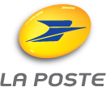

# Zenika explique Docker

<figure style="position: absolute; bottom: 200px; right: 200px">
	<iframe width="560" height="315" src="https://www.youtube.com/embed/Wj2xBIQNwkE" frameborder="0" allowfullscreen></iframe>
</figure>

## Sondage "made in Docker" / Key Finding #1

<figure style="position: absolute; bottom: 50px; right: 0px">
  
</figure>
Notes : sondage fait par Docker (550 réponses) 
Evolution of the Modern Software Supply Chain’ 2016 Survey 
Moitié Dev, moitié Ops

## Sondage "made in Docker" / Key Finding #2

<figure style="position: absolute; bottom: 50px; right: 0px">
  
</figure>

## Sondage "made in Docker" / Key Finding #3

<figure style="position: absolute; bottom: 25px; right: 0px">
  
</figure>

## Sondage "made in Docker" / Key Finding #4

<figure style="position: absolute; bottom: 25px; right: 0px">
  
</figure>

## Sondage "Docker pour les Devs"

<figure style="position: absolute; bottom: 355px; right: 0px">
  
</figure>
<figure style="position: absolute; bottom: 78px; right: 0px">
  
</figure>
Notes : Sondage fait par Shippable (CAAS) en Californie avec 300+ réponses Le premier sondage donne à peu près pareil : Swarm / Google / Amazon

## Usecases client DEV @Zenika

Avantages d'utiliser Docker sur le poste de Dev :

* Pas besoin d'installer manuellement le projet sur la machine de dev
* Pas besoin de le configurer et montée de version simplifiée

<figure style="position: absolute; bottom: 350px;">
	
</figure>
<figure style="position: absolute; bottom: 340px; left:410px">
	
</figure>
<figure style="position: absolute; bottom: 345px; left:730px">
	
</figure>

     

&rarr; Changement rapide de contexte & de projet
 
&rarr; Un Dev qui arrive sur le projet peut lancer le projet uniquement en connaissant Docker.

## Usecases client OPS @Zenika

Avantages d'utiliser Docker en production :

* Même langage que le Dev
* Conteneur = Unité logique Ops
* mais aussi Auchan, Sanofi, Alptis

<figure style="position: absolute; bottom: 270px;">
	
</figure>
<figure style="position: absolute; bottom: 300px; left:410px">
	
</figure>
<figure style="position: absolute; bottom: 300px; left:730px">
	
</figure>

       
&rarr; Pas besoin de connaître tous les langages et leurs frameworks (__HTTP est la norme__)
 
&rarr; Nouvel outil pour tout le monde : cohésion pour amener  une démarche DevOps & microservices
 
&rarr; Facile de mixer du cloud public & privé

# Docker @ Zenika

- Formation officielle Docker le 16 Juin à Nantes
- Atelier "Dockeriser mon app pour le Dev" : 2 à 3j
- Atelier "Sensibilisation Docker pour les Ops " : 1 à 2j

# DockerCon 2016  Seattle   19-21th June

<figure style="position: absolute; bottom: -65px; right: 180px">
  
</figure>

# Questions ?

<figure style="position: absolute; bottom: 80px; right: 180px">
	
	
**@ZenikaNantes**

</figure>
